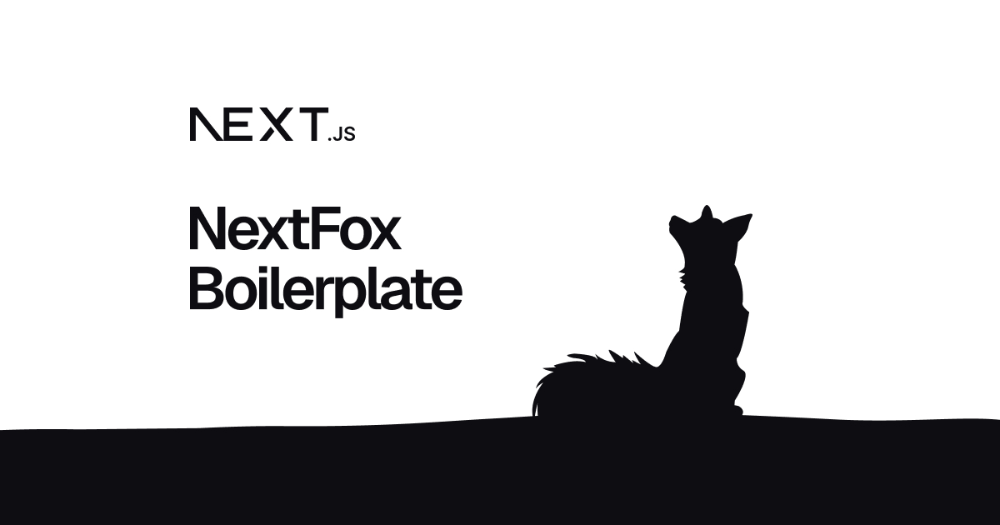

# NextFox - Modern Next.js Boilerplate

NextFox is a modern [Next.js](https://nextjs.org) boilerplate project bootstrapped with [`create-next-app`](https://nextjs.org/docs/app/api-reference/cli/create-next-app), featuring a robust development setup with TypeScript, TailwindCSS, and various tools for code quality.

## 🚀 Features

- ⚡ **Next.js 15** with App Router
- 🎨 **TailwindCSS** with custom configuration
- 🌗 **Dark Mode** support using next-themes
- 📏 **ESLint** and **Prettier** for code formatting
- 🛠️ **TypeScript** for type safety
- 🔍 **Husky** & **lint-staged** for Git hooks
- 🎯 **Conventional Commits** with commitlint
- 🎁 **Radix UI** components integration
- 💅 **Tailwind Merge** & **clsx** for dynamic styling

## 📁 Project Structure

```text
├── app/                   # Next.js app router directory
├── components/            # Reusable UI components
├── config/                # Configuration files
├── lib/                   # Utility functions and shared logic
├── public/                # Static assets
│   ├── opengraph/         # OG images for social sharing
│   ├── favicon/           # Favicon assets
│   └── web-app/           # Web app assets
├── styles/                # Global styles and Tailwind config
└── .husky/                # Git hooks configuration
```

## 🚦 Getting Started

First, run the development server:

```bash
# Install dependencies
pnpm install

# Start development server
pnpm dev
```

Open [http://localhost:3000](http://localhost:3000) with your browser to see the result.

## 🔧 Development

- `pnpm dev` - Start development server
- `pnpm build` - Build production bundle
- `pnpm start` - Start production server
- `pnpm lint` - Run ESLint
- `pnpm lint:fix` - Fix ESLint errors
- `pnpm typecheck` - Check TypeScript types
- `pnpm prettier` - Format code with Prettier

## 📚 Learn More

To learn more about NextFox's stack and technologies:

- [Next.js Documentation](https://nextjs.org/docs)
- [TailwindCSS Documentation](https://tailwindcss.com/docs)
- [TypeScript Documentation](https://www.typescriptlang.org/docs)
- [Radix UI Components](https://www.radix-ui.com/docs/primitives)

## 📤 Deploy

Deploy your NextFox app using the [Vercel Platform](https://vercel.com/new?utm_medium=default-template&filter=next.js&utm_source=create-next-app&utm_campaign=create-next-app-readme).

Check out the [Next.js deployment documentation](https://nextjs.org/docs/app/building-your-application/deploying) for more details.
